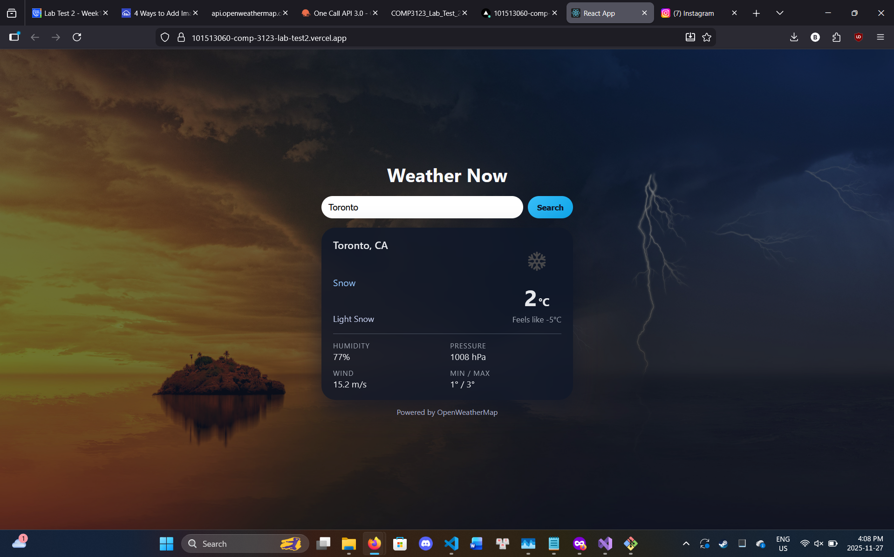
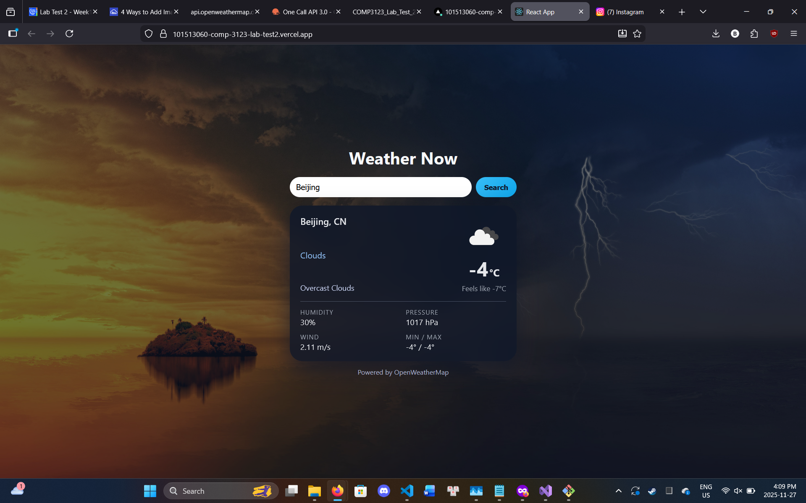

# 101513060_comp3123_labtest2 – Weather App

Simple React app that shows current weather for a city using
[OpenWeatherMap Current Weather API](https://openweathermap.org/current).

## Features

- Search weather by city name
- Displays:
  - City and country
  - Temperature (°C) and "feels like"
  - Description and main condition
  - Weather icon from OpenWeatherMap
  - Humidity, pressure, wind speed, min/max temperature
- Responsive, themed UI (glassmorphism card)
- Built with React Hooks (state & effects) and props-based components

## Tech Stack

- React (Create React App)
- Axios
- OpenWeatherMap API

## Local Setup

```bash
git clone https://github.com/btran369/COMP3123-LabTest2
cd COMP3123-LabTest2/101513060_comp3123_labtest2
npm install
```

## Vercel Deployment
https://101513060-comp-3123-lab-test2.vercel.app/

## Screenshots


